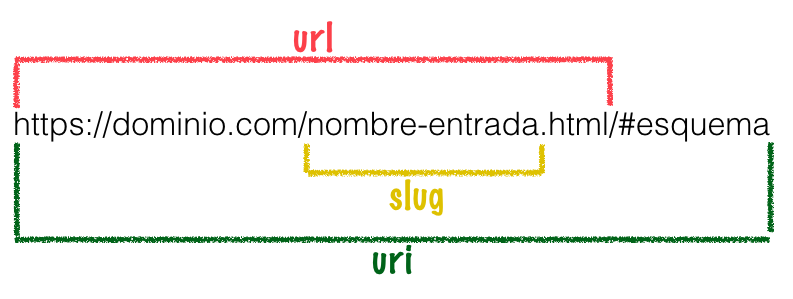
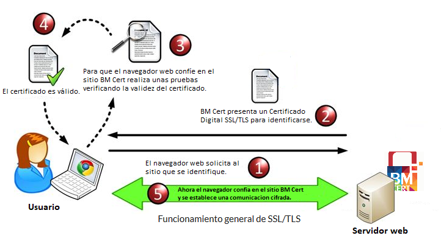

<a href="https://github.com/JoseAlbertoZurera/DesarrolloWebEntornoCliente">Volver al Menú Principal</a>

# Práctica 1 - El Desarrollo Web

## Ataque DoS y DDoS

### Ataque DoS

En los ataques DoS **se generan una cantidad masiva de peticiones al servicio desde una misma máquina o dirección IP**, consumiendo así los recursos que ofrece el servicio hasta que llega un momento en que no tiene capacidad de respuesta y comienza a rechazar peticiones, esto es cuando se materializa la denegación del servicio.

#### Ejemplo DoS

* **Smurf Attack :** Este ataque se basa en mandar un gran número de peticiones echo (ICMP) a direcciones de Broadcast usando una IP de origen falsa. Esto provoca que la IP de origen sea inundada con multitud de respuestas.
* **ICMP Ping Flood:** En este ataque se inunda a la víctima con paquetes ICMP Echo Request.
* **Fraggle Attack:** Es similar al ataque Smurf pero en este caso se envía tráfico UDP en lugar de ICMP.

### Ataque DDoS

En el caso de los ataques DDoS, **se realizan peticiones o conexiones empleando un gran número de ordenadores o direcciones IP.** Estas peticiones se realizan todas al mismo tiempo y hacia el mismo servicio objeto del ataque. Un ataque DDoS es más difícil de detectar, ya que el número de peticiones proviene desde diferentes IP´s y el administrador no puede bloquear la IP que está realizando las peticiones, como sí ocurre en el ataque DoS.

Los ordenadores que realizan el ataque DDoS son reclutados mediante la infección de un malware, convirtiéndose así en bots o zombis, capaces de ser controlados de forma remota por un ciberdelincuente. Un conjunto de bots, es decir, de ordenadores infectados por el mismo malware, forman una **botnet** o también conocida como **red zombi.**

#### Ejemplo DDoS - Ataque contra GitHub (2018)

Este ataque ha sido uno de los **mayores ataques DDoS de la historia** de Internet por el enorme volumen de peticiones que se generaron.
Los atacantes enviaron paquetes a **1,35 Tbps** saturando así los servidores de la plataforma de desarrollo colaborativo GitHub. Lo más curioso es que utilizaron la propia memoria Caché de los servidores de GitHub para amplificar la potencia de ataque.

Durante este ataque, el tráfico de la plataforma se multiplicó por 51.000. A pesar de eso, los sistemas de defensa funcionaron correctamente y el servicio solo estuvo caído durante 5 minutos.

## URI

URI son las siglas en inglés de (Uniform Resource Identifier), que **sirve para identificar recursos en Internet,** precisamente lo que el nombre indica.

Dicho identificador de recursos tiene un formato estándar definido y su propósito es permitir interacción entre recursos disponibles en Internet, o en alguna red de cómputo. Los recursos a los que se refiere son páginas, servicios, imágenes, vídeos, etc.

El URI no se debe confundir con el URL (aunque es muy común que se haga referencia a ellos como la misma cosa), ya que el URI, como se ve en la imagen, es un concepto que incluye al URL. La diferencia fundamental es que los URI identifican y los URL localizan y, como las localizaciones también sirven para identificar, se puede decir que todos los URL son también URI y que, por otro lado, hay URI que no son URL.

## Protocolos de seguridad SSL y TLS

SSL y TSL son **protocolos criptográficos** que encriptan los datos y autentifican una conexión cuando se mueven los datos en Internet. **TLS es una versión más reciente de SSL,** corrige algunas vulnerabilidades de seguridad en los protocolos SSL anteriores.

El Certificado SSL mediante crea una conexión privada, la seguridad se puede ver comprometida si un intruso interviene en el momento en que el servidor web envía la clave pública: el intruso puede falsificar ésta llave aunque el cliente no se ha dado cuenta que está siendo víctima de una falsificación. Por el contrario, con el Certificado TLS este tema queda resuelto.

Por ejemplo, si está procesando pagos con tarjeta de crédito en su sitio web, TLS y SSL pueden ayudarle a procesar esos datos de forma segura para que los agentes maliciosos no puedan poner sus manos en ellos.

## Cifrado DES

DES (Data Encryption Standard) es un esquema de encriptación simétrico desarrollado en 1977 por el Departamento de Comercio y la Oficina Nacional de Estándares de EEUU en colaboración con la empresa IBM, que se creó con objeto de proporcionar al público en general un algoritmo de cifrado normalizado para redes de ordenadores.

En general, DES utiliza una clave simétrica de 64 bits, de los cuales 56 son usados para la encriptación, mientras que los 8 restantes son de paridad, y se usan para la detección de errores en el proceso.

Hoy en día, DES ya no se usa ya que se considera inseguro para muchas aplicaciones. Esto se debe principalmente a que el tamaño de clave de 56 bits es corto; **las claves de DES se han roto en menos de 24 horas.** Existen también resultados analíticos que demuestran debilidades teóricas en su cifrado, aunque son inviables en la práctica.

## Ataque MID

**Consiste en interceptar la comunicación entre 2 o más interlocutores.** Para ello, alguien anónimo llamado "X" se sitúa entre ambos e intercepta los mensajes de A hacia B, conociendo la información y a su vez dejando que el mensaje continúe su camino.

Generalmente este tipo de ataques **son muy peligrosos y difíciles de detectar,** ya que precisamente uno de los objetivos del atacante es evitar ser descubierto, para ello emplean diversas técnicas que complican la detección.

### Ejemplo Ataque MID

Un ejemplo de ataque Man in the Middle es el que se lleva a cabo en los navegadores. Lo que hacen los atacantes es insertar código malicioso en el sistema de la víctima y actúa como intermediario. El objetivo aquí es ir recopilando todos los datos que se introducen en el navegador, las páginas visitadas, etc. Estamos, una vez más, en un intermediario.

## FTP y SSH

FTP significa Protocolo de transferencia de archivos, un protocolo que se creó para la transferencia de archivos desde una ubicación remota a una computadora local, o viceversa. Por otro lado SSH, es un protocolo de red que facilita la comunicación entre dos computadoras, independientemente de la distancia, siempre que haya una ruta eléctrica para el viaje de la comunicación.

Como protocolo de transferencia de archivos, FTP solo es capaz de transferir archivos de un punto a otro, y algunas operaciones básicas de archivos, como copiar, mover o eliminar archivos y directorios. SSH va mucho más allá de esto, ya que le permite al usuario emitir comandos que pueden ser interpretados y ejecutados en la computadora remota por un servidor de escucha.

***Resumen:***

1. FTP es un protocolo de transferencia de archivos, mientras que SSH es un protocolo de red.
2. FTP es intrínsecamente inseguro, mientras que SSH es inherentemente seguro.
3. FTP solo permite el control de archivos, mientras que SSH permite una amplia variedad de aplicaciones.

<a href="#top">Volver Arriba</a>

