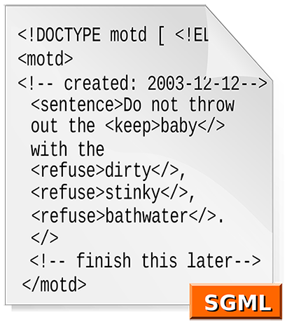

<p align="right"><a href="https://github.com/JoseAlbertoZurera/DesarrolloWebEntornoCliente">Volver al Menú Principal</a></p>

# Práctica 4 - Lenguaje y Herramientas de Programación en Clientes Web (III)

## Visual Studio Code y Visual Studio (Community Edition 2019)

### Visual Studio Code

Visual Studio Code **es un editor de código fuente** desarrollado por Microsoft para Windows, Linux y macOS. Incluye soporte para la depuración, **control integrado de Git**, resaltado de sintaxis, finalización inteligente de código, fragmentos y refactorización de código. También es personalizable, por lo que los usuarios pueden cambiar el tema del editor, los atajos de teclado y las preferencias. Es gratuito y de código abierto,​ aunque la descarga oficial está bajo software privativo e incluye características personalizadas por Microsoft.

***Extensiones Visual Studio Code***

**Las extensiones nos permiten agregar funcionalidad a Visual Studio Code** de forma modular y aislada, son una excelente manera de personalizar nuestra experiencia con la herramienta.

* **Auto Close Tag:** Con este plugin, VSC tiene soporte de etiqueta cerrada para archivos HTML, Handlebars y Razor.
* **Auto Rename Tag:** Esta extensión bastante sencilla cambia automáticamente el nombre de una etiqueta HTML/XML emparejada.
* **Bracket Pair Colorizer 2:** Nunca más tendrás problemas en identificar paréntesis, corchetes o llaves coincidentes gracias a esta extensión. El usuario puede parametrizar una serie de colores para identificar cada pareja.
* **GitLens:** Si queremos potenciar la integración de Git con Visual Studio Code, ésta es nuestra extensión. Facilita el análisis, exploración y trabajo con repositorios Git (opens new window)entre otras funcionalidades. Es ya un imprescindible si trabajas con Git.
* **Gitflow:** Si utilizas el flujo de trabajo gitflow (opens new window)para gestionar tus ramas en Git, no deberías dejar de lado esta extensión para agilizar tus procesos.
* **Live Server:** Esta extensión ofrece de una manera muy rápida un servidor de desarrollo en vivo, fácil de usar y con recarga automática del navegador.
* **JavaScript (ES6) code snippets:** Esta extensión nos permite crear fácilmente fragmentos de código JavaScript con la sintáxis ES6 mediante el uso de pequeños atajos de teclado.

### Visual Studio (Community Edition 2019)

Microsoft Visual Studio Community **es un entorno de desarrollo integrado** (IDE, por sus siglas en inglés) para Windows y macOS. Es compatible con múltiples lenguajes de programación, tales como C++, C#, Visual Basic .NET, F#, Java, Python, Ruby y PHP, al igual que entornos de desarrollo web, como ASP.NET MVC, Django, etc., a lo cual hay que sumarle las nuevas capacidades en línea bajo Windows Azure en forma del editor Monaco.

***Extensiones Visual Studio (Community Edition 2019)***

* **Web Essentials**: Cualquier desarrollador web que se precie debe tener esta extensión. Aquí es donde el equipo web de Visual Studio agrega las nuevas características para así poder obtener comentarios antes de compilarlas en Visual Studio.
* **Optimizador de imágenes:** Esta es otra extensión imprescindible que facilita la optimización de imágenes PNG, JPG y Gif sin necesidad de comprometer la calidad de la imagen.
* **Bundler & Minifier:** Agrega compatibilidad para la unión y minimización de archivos JavaScript, CSS y HTML en cualquier proyecto.
* **Compilador web:** Esta es la forma más fácil y eficaz de compilar archivos LESS, Scss y CoffeeScript directamente en Visual Studio o mediante MSBuild.
* **Analizador web:** Proporciona un análisis estático en Visual Studio para JavaScript, TypeScript, JSX, CSS y muchos más. Usa las últimas versiones de ESLint, TSLint, CSSLint y CoffeeLint.
* **Herramientas PHP:** Las herramientas PHP se centran en la productividad del desarrollador a la vez que respetan las convenciones establecidas.
* Bootstrap Snippet Pack icon
* **Paquete de fragmentos de código de Bootstrap:** Este es el paquete de fragmentos de código definitivo para aquellos desarrolladores web que quieran usar el marco Bootstrap de Twitter.

## JSON

JSON (acrónimo de JavaScript Object Notation, 'notación de objeto de JavaScript') **es un formato de texto sencillo para el intercambio de datos**. Se trata de un subconjunto de la notación literal de objetos de JavaScript, aunque, debido a su amplia adopción como alternativa a XML, se considera (año 2019) un formato independiente del lenguaje.

***Ejemplo de código JSON:***

```JSON

{
  "departamento":8,
  "nombredepto":"Ventas",
  "director": "Juan Rodríguez",
  "empleados":[
    {
      "nombre":"Pedro",
      "apellido":"Fernández"
    },{
      "nombre":"Jacinto",
      "apellido":"Benavente"
    } 
  ]
}

```

## XML

XML son las siglas de Extensible Markup Language, que podemos traducir como Lenguaje de Marcas Extensibles, aunque realmente es un meta-lenguaje.
Normalmente, los archivos XML **contienen información de cualquier tipo**, ya sea información sensible o información de cualquier ámbito.

Habitualmente un fichero XML incluye mucha información y debe de ser procesada correctamente por el usuario, en este caso el desarrollador. Cuanto más grande sea un fichero XML nos estará indicando que más información trae.

***Ejemplo de código XML:***

```XML

<?xml version="1.0" encoding="UTF-8"?>
<selva>
    <animal>
        <nombre>Werthers</nombre>
        <tipo>Pantera</tipo>
        <color>Negro</color>
        <edad>12</edad>
        </animal>
    <animal>
        <nombre>Bun</nombre>
        <tipo>León</tipo>
        <color>Marrón</color>
        <edad>15</edad>
    </animal>
</selva>

```

## JQuery

**JQuery es una librería de JavaScript** (JavaScript es un lenguaje de programación muy usado en desarrollo web). Esta librería de código abierto, simplifica la tarea de programar en JavaScript y permite agregar interactividad a un sitio web sin tener conocimientos del lenguaje.

Basados en esta librería, existe una infinita cantidad de plugins (gratis y pagos) creados por desarrolladores de todo el mundo. Estos plugins resuelven situaciones concretas dentro del maquetado de un sitio, por ejemplo: un menú responsive, una galería de fotos, un carrousel de imágenes, un slide, un header que cambia de tamaño, el deslizamiento del scroll al hacer clic en un botón (anclas HTML), la transición entre páginas y miles de efectos más.

**Todos los plugins de JQuery necesitan la librería de JQuery para funcionar.** La librería es un archivo .js que se puede descargar desde el sitio oficial y colocar en una carpeta js y luego vincular con una etiqueta <script>, por ejemplo:

```JavaScript

<script src="js/jquery-3.2.1.min.js"></script>

```

## GML y SGML

### GML

GML, sigla en inglés de IBM Generalized Markup Language, o lenguaje de marcas generalizado de IBM, **es un conjunto de macros que implementan etiquetas de marcado para el procesador de texto de IBM, SCRIPT, SCRIPT/VS.** Es, por otra parte, el componente principal de «IBM's Document Composition Facility (DCF)», un conjunto inicial de etiquetas de GML incluido en DCF.

GML fue desarrollado entre 1969 y 1970 por Charles Goldfarb, Edward Mosher y Raymond Lorie (cuyas iniciales de apellido fueron usados por Goldfarb para crear el término GML)

El desarrollo de GML cambiaría en 1986 según la norma ISO 8879 al Standard Generalized Markup Language (SGML), que es un estándar ISO para definir lenguajes de marcas generales para documentos descendiente del GML.

### SGML

SGML es un acrónimo de Standard Generalized Markup Language o Lenguaje de Señalización General Normalizado.

**Esta es una norma ISO derivada de una anterior (GML de IBM)**. SGML permite que la estructura de un documento pueda ser definida en base a la relación lógica de sus partes. Esta estructura puede ser validada por una Definición de Tipo Documento (DTD - Document Type Definition). La norma SGML define la sintaxis del documento y la sintaxis y semántica de DTD.

Un documento SGML se marca de modo que no dice nada respecto a su representación en la pantalla o en papel. Un programa de presentación debe unir el documento con la información de estilo a fin de producir una copia impresa en la pantalla o en el papel.



<p align="right"><a href="#top">Volver Arriba</a></p>
