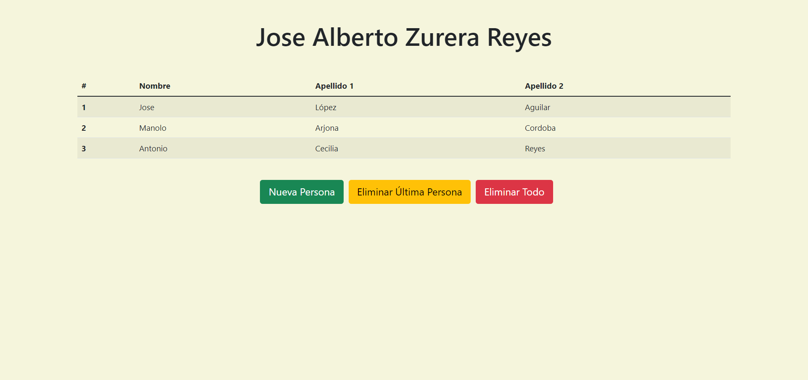

<a href="https://github.com/JoseAlbertoZurera/DesarrolloWebEntornoCliente">Volver al Menú Principal</a>

# Práctica 5 - Programación Orientada A Objetos Con JavaScript

## Funcionalidad

En ésta Practica se creado un fichero de script, persona.js en la que se creará la clase Persona, que almacenará las propiedades y atributos de cada persona perteneciente a la lista. Esta clase está compuesta por los siguientes atributos y métodos:

### Atributos

* **_nombre:** atributo que almacenará el nombre de la persona.
* **_apellidos:** atributo que almacenará los apellidos de la persona.

### Métodos

* **get Nombre():** método que devuelve el valor del atributo _nombre del objeto Persona actual.
* **set Nombre(nombre):** método que asigna al atributo _nombre del objeto Persona el nombre introducido como argumento.
* **get Apellidos():** método que devuelve el valor del atributo _apellidos del objeto Persona actual.
* **set Apellidos(apellidos):** método que asigna al atributo _apellidos del objeto Persona los apellidos introducidos como argumento.

La página web, desarrollada en el documento index.html le pasamos el script persona.js. En este se muestra una tabla con el listado de personas contenidas en el Array.

***Lenguajes Usados***

* HTML
* JavaScript
* CSS

***Librerias Usadas***

* Bootstrap 5
* SweetAlert

## Captura

<a href="#top">Volver Arriba</a>

