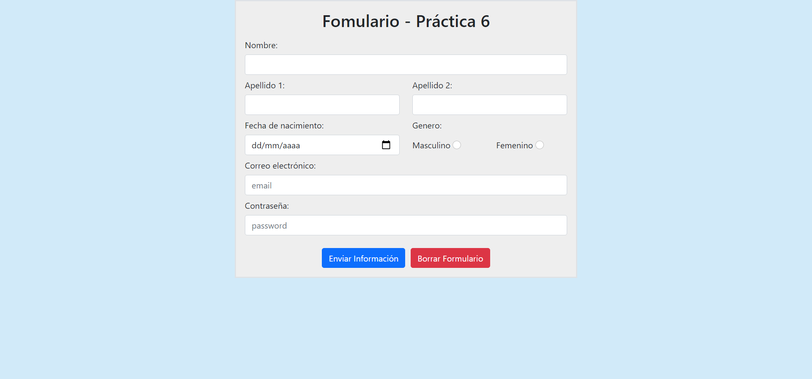

<a href="https://github.com/JoseAlbertoZurera/DesarrolloWebEntornoCliente">Volver al Menú Principal</a>

# Práctica 6 - Interacción Con El Usuario

## Funcionalidad

La práctica consiste en la creación de un formulario de HTML de registro que contiene los siguientes elementos:

* Nombre: En este se genera un elemento de entrada de texto (text) en el que se introduce el nombre.

* Apellido 1: En este se genera un elemento de entrada de texto (text) en el que se introduce el primer apellido.

* Apellido 2: En este se genera un elemento de entrada de texto (text) en el que se introduce el segundo apellido.

* Género: Elemento botón de radio (radio button), en el que se selecciona el género del usuario (Masculino/Femenino).

* Fecha de nacimiento: Elemento de tipo fecha (date), en el que el usuario introduzce la fecha de nacimiento.

* Correo Electrónico: Elemento de entrada de tipo e-mail (email) en el que se introduzce el correo electrónico del usuario.

* Contraseña: Elemento contraseña (password), que introduce el usuario durante el registro para su posterior identificación.

* Enviar: Botón de tipo "submit" que cuando se clique en él envíe los datos al servidor server.php y una validación JavaScript que se encarge de mostrar en una alerta los datos almacenados en el formulario.

### Métodos JavaScript

* **validacionFormulario():** Función que se encarga de recoger valores del formulario, los almacena en variables y los muestra en forma de alerta.
* **obtenerFechaActual():** Función que recoge la hora local y devuelve la fecha actual en formato "yyyy-mm-dd para posteriormente añadirlo como valor máximo al formulario.

***Lenguajes Usados***

* HTML
* JavaScript
* CSS

***Librerias Usadas***

* Bootstrap 5

## Captura

<a href="#top">Volver Arriba</a>

