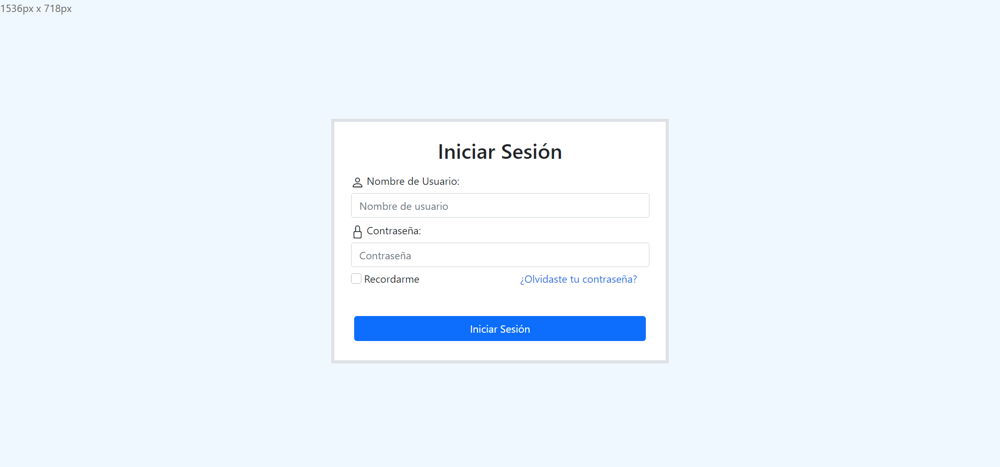

<a href="https://github.com/JoseAlbertoZurera/DesarrolloWebEntornoCliente">Volver al Menú Principal</a>

# Práctica 7 - Eventos, Expresiones Y Cookies

## Objetivos

La práctica consiste en la creación de un formulario de HTML de inicio de sesion que contiene los siguientes elementos:

* **Nombre de usuario:** elemento de entrada tipo texto en el que se tenga que escribir un nombre de usuario o nickname, (no se puede dejar el campo vacío).
* **Contraseña:** elemento de entrada tipo contraseña en el que se escriba la contraseña.
* **¿Olvidaste tu contraseña?:** un texto que cuando se pulse en él, te redirije a una página web que se indicará en la siguiente enumeración.
* **Recuerdame:** elemento de tipo checkbox sin ninguna funcionalidad, para en un futuro poder añadirla.
* **Un botón submit** para enviar los resultados del formulario a un archivo server.php.

### Funcionalidad

**Dentro de este formulario, se manejan los siguientes eventos:**

* Una vez que el cursor está dentro del campo de contraseña, en caso de que estén las mayúsculas bloqueadas, muestra un mensaje no modal en el formulario que indique que este modo está activado.
* Si se clicka en Enviar te redirige al servidor.
* Se muestra siempre arriba a la izquierda las dimensiones de la ventana, de forma que si esta es agrandada o minimizada muestre en tiempo real las dimensiones de la ventana del navegador.
* Si se clicka una vez en el texto "¿Olvidaste tu contraseña?", muestra una alerta indicando que no tienes permisos de superusuario para reestablecerla.
* Si se clicka dos veces en el texto "¿Olvidaste tu contraseña?", te redirige a esta página: "https://www.youtube.com/watch?v=dQw4w9WgXcQ".

### Métodos JavaScript

* **alertaPermisos():** Función que ejecuta una alerta informando de que el usuario no tiene permisos de superusuario para reestablecer la contraseña usando la librería SweetAlert2.

***Lenguajes Usados***

* HTML
* CSS
* JavaScript

***Librerias Usadas***

* Bootstrap 5
* SweetAlert2

## Captura

<a href="#top">Volver Arriba</a>
