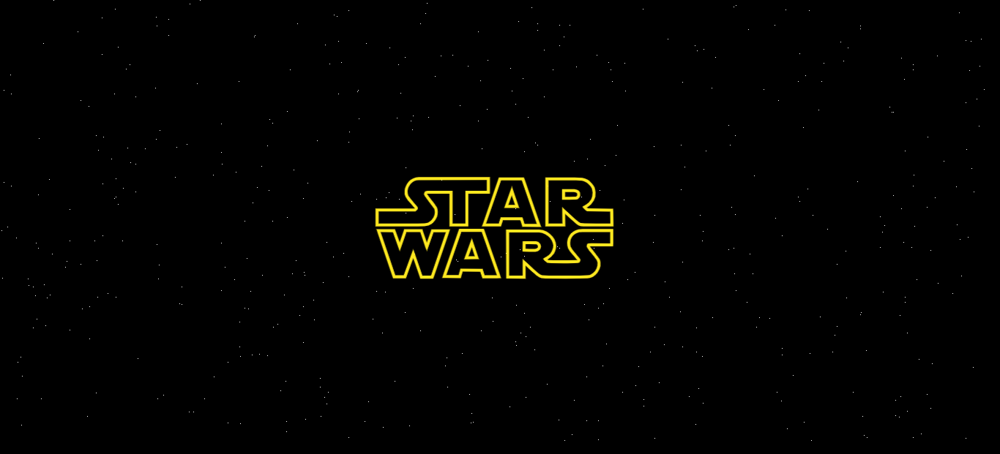

<p align="right"><a href="https://github.com/JoseAlbertoZurera/DesarrolloWebEntornoCliente">Volver al Menú Principal</a></p>

# Práctica 8 - Dinamismo en el Desarrolllo de Páginas Web

## Objetivos

* Página web en la que mediante animaciones se muestra la imagen y el texto de introducción de la película **Star Wars I - La Amenaza Fantasma**, en el que el texto se desliza y se aleja hacia arriba y atrás, siendo el estilo de la página lo más fidedigno posible al obtenido en la película.

* También se ha incluido en la página la síntonía principal de la película.

### Funcionalidad

* Al cargar la página se llama a la función *"crearEstrellas(numEstrellas)"* y se añaden como fondo a la página web.
* **Botón Iniciar:** Al pulsar éste botón llama a la función *"iniciar()"* y empieza la animación y el sonido.

### Métodos JavaScript

* **iniciar():** Función que inicia la animacíon y el sonido.

```JavaScript
function iniciar() {
  sonido.play();
  $("#contenedorPrincipal").css("display", "block");
  $("#buttonIniciar").css("display", "none");
}
```  

* **getRandomPosition():** Función que obtiene el acho y el alto aleatorio basados ​​en el tamaño de la ventana.

```JavaScript
function getRandomPosition() {
  let width = window.innerWidth - 20;
  let height = window.innerHeight - 20;
  let randomWidth = Math.floor(Math.random() * width);
  let randomHeight = Math.floor(Math.random() * height);
  return [randomHeight, randomWidth];
}
```  

* **crearEstrellas(numEstrellas):** Función que recibe un número de estrellas y las muestra como fondo en el body.

```JavaScript
function crearEstrellas(numEstrellas) {
  for (let i = 0; i < numEstrellas; i++) {
    let xy = getRandomPosition();
    $('body').append('<div class="estrellas" style="top: ' + xy[0] + 'px; left: ' + xy[1] + 'px";></div>');
  }
}
```

***Lenguajes Usados***

* HTML
* CSS
* JavaScript

***Librerias Usadas***

* jQuery

### Captura



<p align="right"><a href="#top">Volver Arriba</a></p>